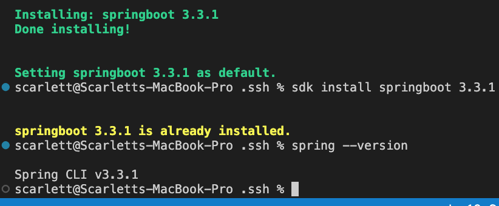

# Data base


I need to install:

SDK: Java Corretto-21 (done)

MySQL 8.0.37 (done)

Spring Boot – 3.3.1 (done)

Maven - apache-maven-3.9.7 (done)

# 

for the `MySQL 8.0.37 ` depenciy install:

```
# run an update
sudo apt update -y

# run an upgrade
sudo DEBIAN_FRONTEND=noninteractive apt-get upgrade -yq

# download latest package
wget https://dev.mysql.com/get/mysql-apt-config_0.8.30-1_all.deb

# Install the package

sudo dpkg -i mysql-apt-config_0.8.30-1_all.deb

(choose ok)

click update
sudo apt update

sudo apt install mysql-server
```


$ java -version

sudo apt install openjdk-21-jdk


# Installing Apache Maven 3.9.7 on Ubuntu 22.04

Follow these steps to install Apache Maven 3.9.7 on Ubuntu 22.04:

```wget https://dlcdn.apache.org/maven/maven-3/3.9.7/binaries/apache-maven-3.9.7-bin.tar.gz```


## Extract the Downloaded Archive:
```
tar -xzf apache-maven-3.9.7-bin.tar.gz
```

## Move the Extracted Maven Directory to /opt:

```
sudo mv apache-maven-3.9.7 /opt/apache-maven-3.9.7

```
## Set Up Environment Variables:

Open or create the maven.sh file in the /etc/profile.d/ directory:

```
sudo nano /etc/profile.d/maven.sh
```

## Add the following lines to the file:
```
export MAVEN_HOME=/opt/apache-maven-3.9.7
export PATH=$MAVEN_HOME/bin:$PATH

```
Save the file and exit the text editor.

## Make the Script Executable:

```
sudo chmod +x /etc/profile.d/maven.sh

```

## Load the Environment Variables:

```
source /etc/profile.d/maven.sh
```

## Verify the Maven Installation:

```
mvn -version

```
# install spring boot

 ##install SDKMAN!

```
curl -s "https://get.sdkman.io" | bash
source "$HOME/.sdkman/bin/sdkman-init.sh"
```

## install springboot
```
sdk install springboot
```
install springboot cli
```
sdk install springboot 3.3.1
```
## verify installation
spring --version




# Amazon Coretto 21


##prep env

```
sudo apt update
sudo apt install -y apt-transport-https ca-certificates curl software-properties-common
curl -fsSL https://apt.corretto.aws/corretto.key | sudo apt-key add -
sudo add-apt-repository 'deb https://apt.corretto.aws stable main'
```

## install Coretto21

sudo apt update
sudo apt install -y apt-transport-https ca-certificates curl software-properties-common
curl -fsSL https://apt.corretto.aws/corretto.key | sudo apt-key add -
sudo add-apt-repository 'deb https://apt.corretto.aws stable main'

## verify the installation
java -version


openjdk version "17.0.2" 2022-07-19
OpenJDK Runtime Environment Corretto-21.2.0.8.1 (build 17.0.2+8)
OpenJDK 64-Bit Server VM Corretto-21.2.0.8.1 (build 17.0.2+8, mixed mode, sharing)


References:

https://askubuntu.com/questions/1515139/how-to-use-apt-to-install-mysql-8-0-37-on-ubuntu-22-04
https://www.youtube.com/watch?v=sY_9CwGSCJ0
https://www.digitalocean.com/community/tutorials/how-to-install-java-with-apt-on-ubuntu-22-04
https://askubuntu.com/questions/1492571/install-openjdk-21


Questions:

do I need to set up Setting JAVA_HOME (Optional)


# APP


Working app manual deployment 

```
#!/bin/bash

# update and upgrade

sudo apt update -y
sudo DEBIAN_FRONTEND=noninteractive apt-get upgrade -y

# change restart function to auto 
sed -i "s/#\$nrconf{restart} = 'i';/\$nrconf{restart} = 'a';/" /etc/needrestart/needrestart.conf

# update and upgrade without user intervention
sudo apt update -y
sudo DEBIAN_FRONTEND=noninteractive apt-get upgrade -y

# install nginx
sudo apt install nginx -y
sudo sed -i "s|try_files .*;|proxy_pass http://127.0.0.1:3000;|g" /etc/nginx/sites-available/default

# restart nginx
sudo systemctl restart nginx

# enable nginx
sudo systemctl enable nginx

# download node.js
curl -fsSL https://deb.nodesource.com/setup_20.x | sudo -E bash - &&\

# install node.js
sudo apt-get install -y nodejs

# Install Node.js and npm
curl -sL https://deb.nodesource.com/setup_20.x | sudo -E bash -
sudo apt-get install -y nodejs

#Git clone
git clone https://github.com/im-e/traffic-risk-app.git

#Cd into app folder
Cd traffic-risk-app/frontend/src

Npm install 
Npm start

```


#  make a new branch
git checkout -b deployment


jenkins server:

